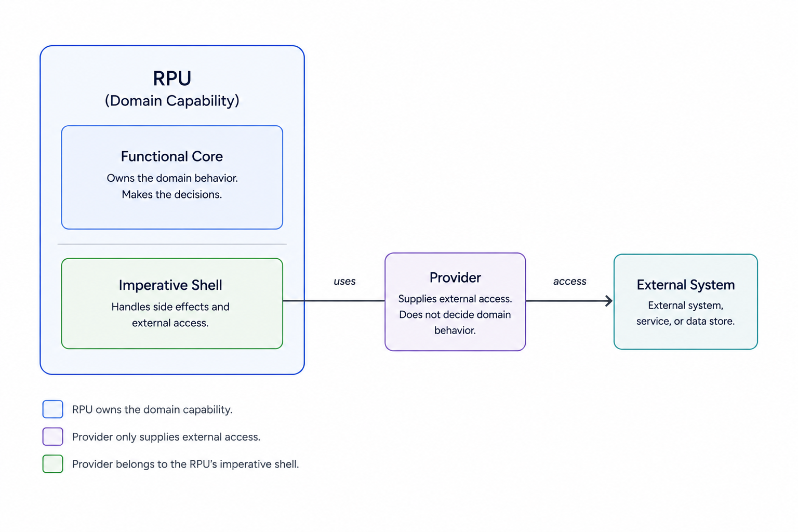
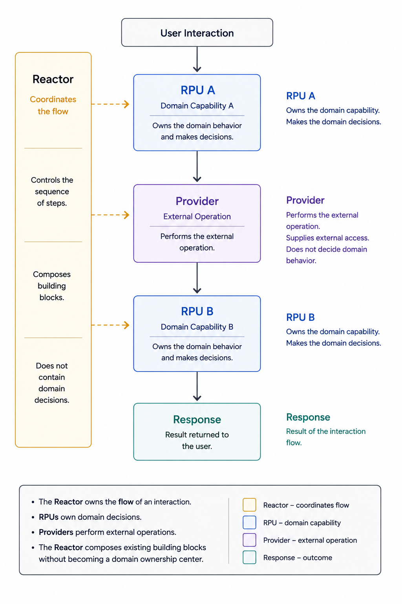

# Providers

A Provider gives access to an external resource or capability outside the domain.

It hides technical access behind a small callable surface.

In this documentation, Provider means an external provider. Domain State Provider is a special case and will be documented separately.

## External Capability

A Provider represents something the domain does not own.

Examples:

- authentication
- email delivery
- payment processing
- notifications
- file storage
- time
- random numbers
- communication
- third-party APIs

The Provider owns the technical access to that capability.

The domain does not own the external capability.

## Provider Boundary

A Provider may know about protocols, credentials, APIs, network calls, retries, rate limits, external data formats, or other technical details.

Code that uses a Provider should not need to know those details.

The Provider exposes the external capability through a clear boundary.

## Shape

A Provider exposes operations.

The exact operation names depend on the external capability.

Examples:

```text
authenticate(request) -> result
send_email(request) -> result
create_payment(request) -> result
send_notification(request) -> result
upload_file(request) -> result
```

The important part is not the method name.

The important part is that external access is separated from domain decisions.

## Relationship to RPUs

An RPU owns one domain capability.

An RPU may use a Provider directly when the external capability is part of that one domain capability's processing.

In that case, the Provider belongs to the RPU's imperative shell.

The RPU still owns the domain capability.

The Provider only supplies external access.

The Provider does not decide the domain behavior.

A Provider call inside an RPU must not become hidden cross-capability orchestration.



## Relationship to Reactors

A Reactor may coordinate RPUs and Providers.

Use a Reactor when an interaction combines multiple domain capabilities, multiple external operations, or a sequence of steps around one interaction.

The Reactor controls the flow.

The RPU owns the domain capability.

The Provider performs the external operation.

The Reactor does not contain domain decisions.



## Direct Use or Reactor

A Provider does not automatically require a Reactor.

Use the Provider directly inside an RPU when the external capability is needed to process that single domain capability.

Use a Reactor when the interaction coordinates an RPU with external work around the domain capability.

Examples:

RPU uses Provider directly
= the Provider is needed for one capability decision or completion

Reactor uses Provider
= the interaction coordinates domain behavior and external effects

The boundary is the capability.

If the Provider is needed inside one capability, it can be used by the RPU.

If the Provider is part of a broader interaction flow, use a Reactor.

## Testability

Code that uses a Provider can be tested with a replacement Provider.

The test does not need the real external system.

The test can define the Provider response directly and verify how the caller reacts.

Provider implementation tests can separately verify the real external integration.

## Summary

A Provider is:

* a boundary to an external resource or capability
* outside the domain state
* technical rather than domain-owning
* callable through a small public surface
* replaceable for tests
* free of domain decisions

An RPU may use a Provider directly when the Provider is needed for one domain capability.

A Reactor coordinates Providers when an interaction spans multiple capabilities or external operations.
