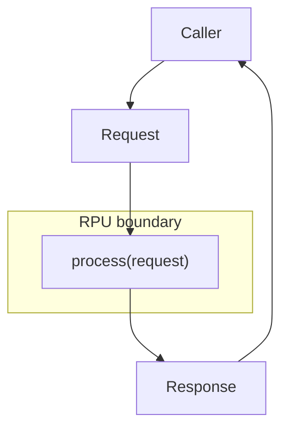
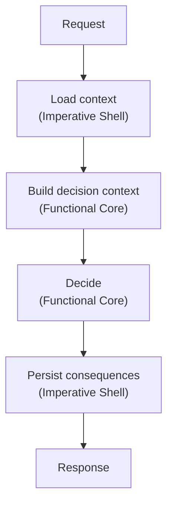
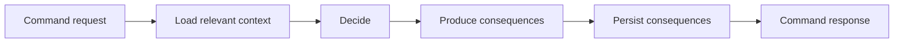
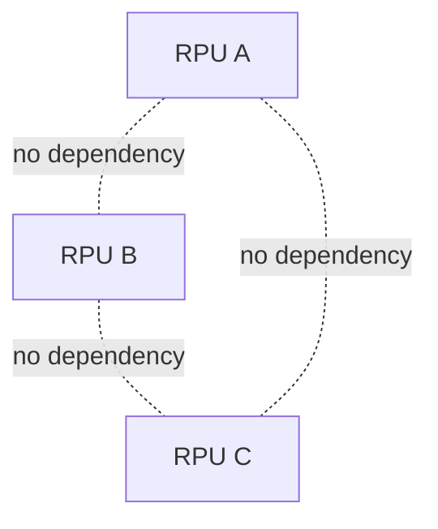

# Request Processing Units

A Request Processing Unit, or RPU, implements one domain capability.

It has one public shape:

```text
process(request) -> response
```

The request enters the RPU. The response leaves the RPU. Everything else is internal.


## Domain Capability

An RPU owns exactly one capability of the domain.

A capability can be a command or a query.

A command decides whether something should happen and produces a response such as success, rejection, validation errors, or committed consequences.

A query answers a question and returns the requested result.

Commands and queries stay separate.

## Public Surface

The public surface of an RPU is its request and response.

The caller does not see the internal state, persistence mechanism, decision structure, or implementation files.



The RPU boundary is the coordination boundary.

Other code depends on the request and response contract, not on the internal implementation.

## Internal Structure

An RPU is a self-contained capability processor with an internal Functional Core / Imperative Shell structure.

The Imperative Shell handles state access and persistence.

The Functional Core builds the decision context and makes the decision.



The RPU as a whole is not pure.

The decision part should be deterministic and easy to test.

The shell part connects the decision to persisted state and technical execution.

## Command RPU

A command RPU processes a request that can change the domain.



A command RPU should contain everything needed for that command capability.

It does not call another RPU.

It owns the complete processing path for its capability.

## Query RPU

A query RPU processes a request that reads from the domain.


A query RPU returns the result needed by the caller.

Larger transformations that belong to the domain should live inside a query RPU, not outside the domain boundary.

## Independence

An RPU is independently understandable, implementable, and testable.

It owns one capability.

It has one request and one response.

It does not depend on other RPUs.

Its internal state access can be replaced for tests.



This independence allows different capabilities to be developed in parallel without sharing internal code or state.

## Summary

An RPU is:

- one domain capability
- one `process(request) -> response` contract
- self-contained
- independent from other RPUs
- internally structured as Functional Core / Imperative Shell
- testable without a user interface
- focused on domain behavior, not technology
